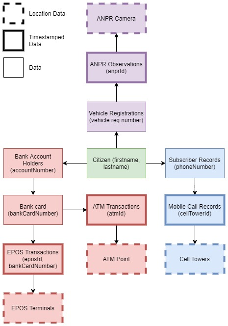
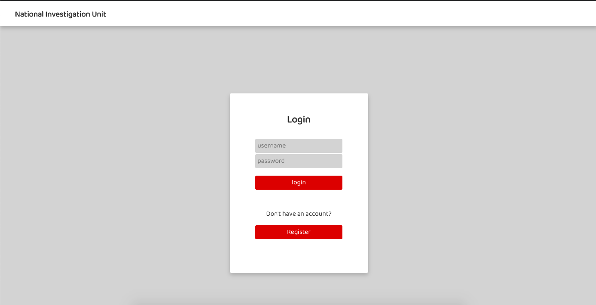
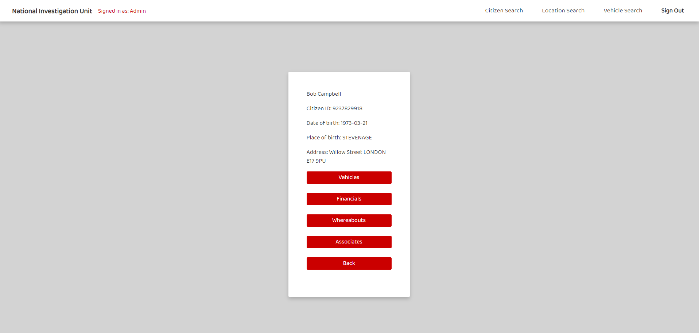
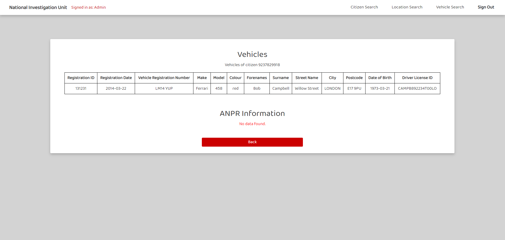
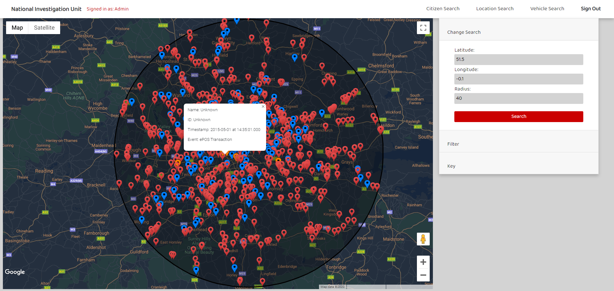

# National Investigation Unit

## Description 

NIU is a SERN stack application with user authentication via Passport and JWTs. This project was made to complete three tasks: reveal details of a detained suspect, locate the whereabouts and owner of a vehicle and find events occuring within an area at a specific time. As such, this application can be used to access senstive information pertaining to a citizen's biographical and financial information as well as their whereabouts and associates. See the functionality overview section for further information. 

## Data Architecture

The data for this project was received in the form of multiple CSV files with repeating fields. This data was first broken up and relationships were established. These relations can be seen in the diagram below.



It can be seen that the three focuses are vehicles, financials and calls. All other data builds into these three areas and each originate from a citizen. 

## Getting Started

Following these instructions will get you a copy of the project up and running on your local machine for development and testing purposes. See deployment for notes on how to deploy the project on a live system.

### Prerequisites

To get the front-end running locally:
                                                    
* Clone this repository to your local machine using ```https://github.com/tigs1995/Front-End-Final-Project.git ```
                                                    

### Installing

To get the development environment running, open the terminal in the folder where you have cloned the project to and run the following commands:

* To install all required dependecies
```
$ npm install              
```

* To start the local server (this project uses create-react-app)
```
$ npm start
```
* Open ```http://localhost:3000``` to view it in the browser

 

* To run selenium tests- selenium tests are written in Java
```
Install Eclipse or another Java IDE
```
### Making requests to the backend API

To get the back-end running locally:

 The source code for the backend server can be found in the repo ```https://github.com/Ewan-James-Donovan/bae-project-back-end.git. ```

Run the same commands as specified for the front-end. Tables will be automatically generated and the application will be ready to use.

## Running the tests

To run the selenium tests for the front-end of the application use the following repo:

```
https://github.com/tigs1995/SeleniumFinalProject.git
```

Open the cloned project in either Eclipse or another Java IDE

```
Run the front and backend of the application
```

```
Run the selenium tests in the Java IDE
```
### Break down into end to end tests

Explain what these tests test and why

```
Give an example
```

## Deployment

Add notes about how to deploy this on a live system here

## Built With

* [React](https://reactjs.org/) - The JavaScript library and framework used
* [Visual Studio Code](https://code.visualstudio.com//) - Source-code editor
* [Redux](https://redux.js.org/) - State management tool used for the React application
* [Json Web Tokens (JWTs)](https://jwt.io/) - Used to generate access tokens for the application
* [Passport](http://www.passportjs.org/) - The JavaScript authentication middleware used 
* [Eclipse](https://www.eclipse.org/)  - Java IDE used to write and test Selenium 
* [Selenium](https://www.selenium.dev/) - Used for automated testing 
* [Sequelize](https://sequelize.org/) - Used to setup SQL database
* [AWS](https://aws.amazon.com/) - Used to host the database and testing/live environment

## Functionality

### Site Map

Below is a screenshot showing the flow of the application. You are unable to access any section until you are logged in. Upon logging in you are sent a JWT token which is checked upon accessing any page. Also, if you possess a JWT token, you cannot go to the login or register page.

### Front-End Design


Upon logging in, you will be taken to the homepage where you can begin one of your three searches:


Each search allows for inserting partial information, for example, just a first name, or a few characters of a number plate. You will be taken to a list of all partial matches to your search.


The screenshot above shows all partial matches to a search of just Anthony. You can select to view more information on any citizen.



Upon viewing a citizen, you can view all gathered information on them, including their known vehicles, bank cards and transactions, their associates as determined by phone call interactions and their whereabouts. The whereabouts button will take you to a Google Map page with pins plotted of all known appearances.



The screenshot above shows the layout of the vehicle page related to this citizen. Their know vehicles are displayed in a sortable table along with any sightings from cameras.



The location search allows you to specify a location via latitude and longitude, along with a timeframe and radius. These results are used to plot a region on a map and display any events within that timeframe and location. The events are colour-coded to correspond to vehicle sightings, calls and financial transactions. Each pin can be clicked on to display more information and the citizen behind the event, and the information can also be clicked on again to be taken to that citizen's homepage.

### Functionality Summary: 

* Authenticate users via JWT(login / register pages and logout button)
* Access citizen's biographical and financial information as well as their whereabouts and associates.
* Searching for citizen by forenames and surname 
* Search for a vehicle and its information by registration number
* GET and display lists of vehicle and citizens and display their information
* Ability to render partial matches upon search, i.e for citizen or vehicle
* Searching for events by location, timestamp and radius
* Google maps capability
* Ability to view financial, call and vehicle data geographically 

### Page breakdown:

* Sign in/Register Pages (URL:/#/)
    * Use JWT (store the token in sessionStorage)
* Home Page (URL:/HomePage)
    * Citizen, vehicle and location search buttons
* Citizen search page(/CitizenSearch")
    * Search a citizen by forenames and surnames
* Vehicle search page(URL:/VehicleSearch)
    * Search a vehicle by registration number
* Location search page (URL:/LocationSearch)
   * Search events by location, timestamp and radius
* Citizen / vehicle results pages (URL:/CitizenList/:forenames/:surname ) (URL:/VehicleList/:reg)
   * List of citizen/vehicle results including parial matches
   * List of citizens/ vehicles can be toggled alphanumerically by selecting column
* Vehicle profile page (URL:/CitizenVehicles/:id/:pag)
    * Shows citizen vehicle information including ANPR data
* Citizen profile page (URL:/CitizenHome/:id)
    * Shows citizen biographical data
    * Buttons to navigate to citizen finances, vehicles, whereabouts(links to map page), calls data.
* Map page (URL:/Map/:radius/:lat/:long/:afterTime/:beforeTime)(URL:/CitizenMap/:id/:afterTime/:beforeTime)
    * Renders react-google-map 
    * Can be accessed from Location search or via citizen profile page
    * Populated with color-coded markers for the relevant financial, calls and vehicle information searched for. 
    * Clickable markers to navigate to relevant citizen's profile
    * Side bar and filters to toggle data displayed on the map
* Associates page( URL:/CitizenAssociates/:id)
    * Table displaying a citizen's associates based on calls data
* Financials page(URL:/CitizenFinancials/:id)
    * Tables displaying citizen's financial information

## Authors

* **Alex Russo** 
* **Alwin Thomas** 
* **Elizabeth Colwell** 
* **Ewan Donovan** 
* **Jonathan Georgiou** 
* **Tigs Knowles** 


## Acknowledgments

* We would like to show our gratitude to Jordan for his help, guidance and enthusiasm throughout our time at the academy. This has greatly contributed to the success of this project.

* Thanks also to Nick and Ian for helping us solve the bugs in our code that would have kept us up at night.

* The rest of our cohort for valuable suggestions and feedback which gave us the inspiration to improve our project.


