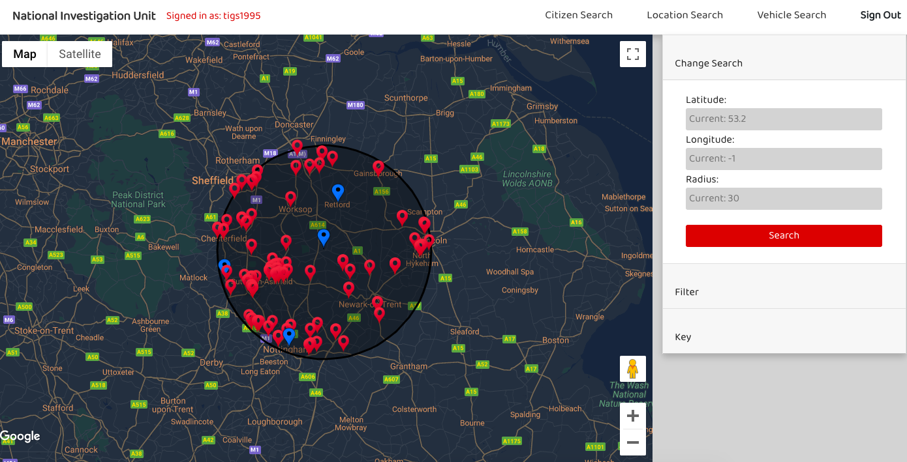
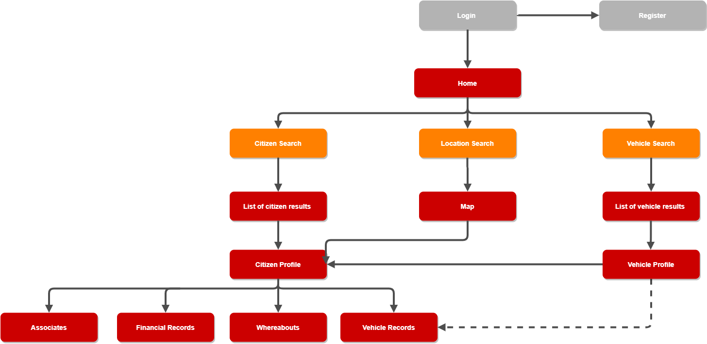

# National Investigation Unit

 
 

## Description 

NIU is a SERN stack application with user authentication via Passport and JWTs. The application can be used to access senstive information pertaining to a citizen's biographical and financial information as well as their whereabouts and associates. See the functionality overview section for further information. 


## Getting Started

Following these instructions will get you a copy of the project up and running on your local machine for development and testing purposes. See deployment for notes on how to deploy the project on a live system.


### Prerequisites

To get the front-end running locally:
                                                    
* Clone this repository to your local machine using ```https://github.com/tigs1995/Front-End-Final-Project.git ```
                                                    

### Installing

To get the development environment running, open the terminal in the folder where you have cloned the project to and run the following commands:

* To install all required dependecies
```
$ npm install              
```

* To start the local server (this project uses create-react-app)
```
$ npm start
```
* Open ```http://localhost:3000``` to view it in the browser

 

* To run selenium tests- selenium tests are written in Java
```
Install Eclipse or another Java IDE
```
### Making requests to the backend API


- notes on how connect to BE 

 The source code for the backend server can be found in the repo ```https://github.com/Ewan-James-Donovan/bae-project-back-end.git. ```


## Running the tests


To run the selenium tests for the front-end of the application:

```
Clone this repository to your local machine https://github.com/tigs1995/SeleniumFinalProject.git
```

Open the cloned project in either Eclipse or another Java IDE

```
Run the front and backend of the application
```

```
Run the selenium tests in the Java IDE
```
### Break down into end to end tests

Explain what these tests test and why

```
Give an example
```


## Deployment


Add notes about how to deploy this on a live system here

## Built With

* [React](https://reactjs.org/) - The JavaScript library and framework used
* [Visual Studio Code](https://code.visualstudio.com//) - Source-code editor
* [Redux](https://redux.js.org/) - State management tool used for the React application
* [Json Web Tokens (JWTs)](https://jwt.io/) - Used to generate access tokens for the application
* [Passport](http://www.passportjs.org/) - The JavaScript authentication middleware used 
* [Eclipse](https://www.eclipse.org/)  - Java IDE used to write and test Selenium 
* [Selenium](https://www.selenium.dev/) - Used for automated testing 


## Functionality Overview

### General Functionality: 

* Authenticate users via JWT(login / register pages and logout button)
* Access citizen's biographical and financial information as well as their whereabouts and associates.
* Searching for citizen by forenames and surname 
* Search for a vehicle and its information by registration number
* GET and display lists of vehicle and citizens and display their information
* Ability to render partial matches upon search, i.e for citizen or vehicle
* Searching for events by location, timestamp and radius
* Google maps capability
* Ability to view financial, call and vehicle data geographically 


### Page breakdown:

* Sign in/Register Pages (URL:/#/)
	* Use JWT (store the token in sessionStorage)
* Home Page (URL:/HomePage)
	* Citizen, vehicle and location search buttons
* Citizen search page(/CitizenSearch")
 	* Search a citizen by forenames and surnames
* Vehicle search page(URL:/VehicleSearch)
 	* Search a vehicle by registration number
* Location search page (URL:/LocationSearch)
   * Search events by location, timestamp and radius
* Citizen / vehicle results pages (URL:/CitizenList/:forenames/:surname ) (URL:/VehicleList/:reg)
   * List of citizen/vehicle results including parial matches
   * List of citizens/ vehicles can be toggled alphanumerically by selecting column
* Vehicle profile page (URL:/CitizenVehicles/:id/:pag)
	* Shows citizen vehicle information including ANPR data
* Citizen profile page (URL:/CitizenHome/:id)
	* Shows citizen biographical data
	* Buttons to navigate to citizen finances, vehicles, whereabouts(links to map page), calls data.
* Map page (URL:/Map/:radius/:lat/:long/:afterTime/:beforeTime)(URL:/CitizenMap/:id/:afterTime/:beforeTime)
	* Renders react-google-map 
	* Can be accessed from Location search or via citizen profile page
	* Populated with color-coded markers for the relevant financial, calls and vehicle information searched for. 
	* Clickable markers to navigate to relevant citizen's profile
	* Side bar and filters to toggle data displayed on the map
* Associates page( URL:/CitizenAssociates/:id)
	* Table displaying a citizen's associates based on calls data
* Financials page(URL:/CitizenFinancials/:id)
	* Tables displaying citizen's financial information

## Site Map




## Authors

* **Alex Russo** 
* **Alwin Thomas** 
* **Elizabeth Colwell** 
* **Ewan Donovan** 
* **Jonathan Georgiou** 
* **Tigs Knowles** 


## Acknowledgments

* 


